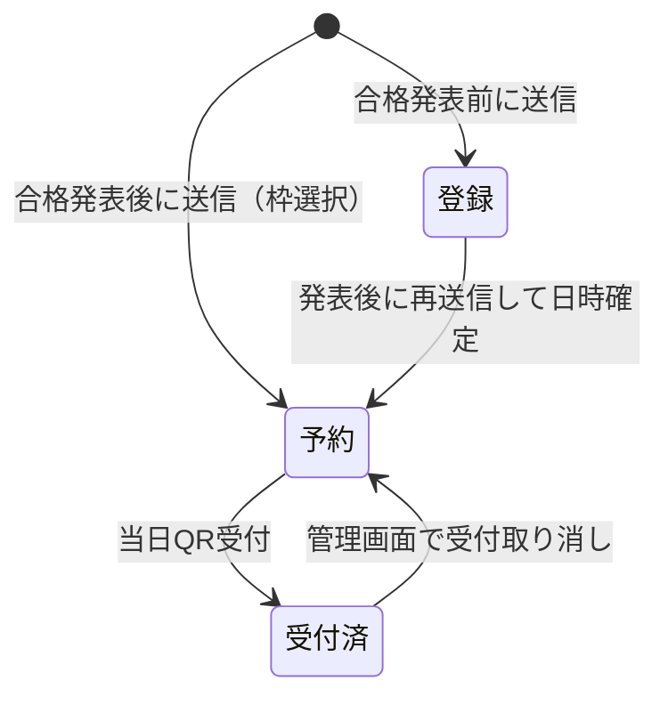
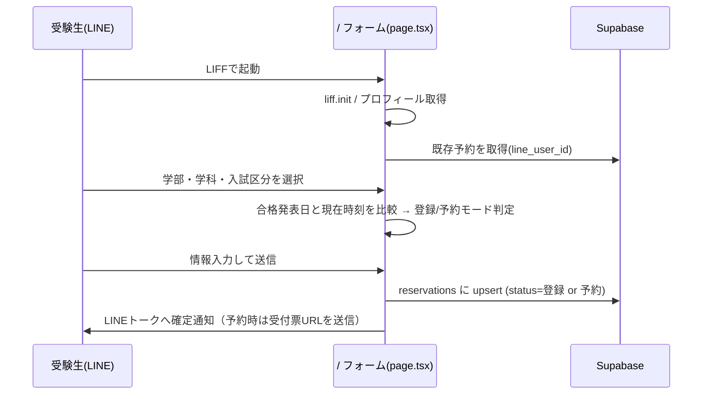
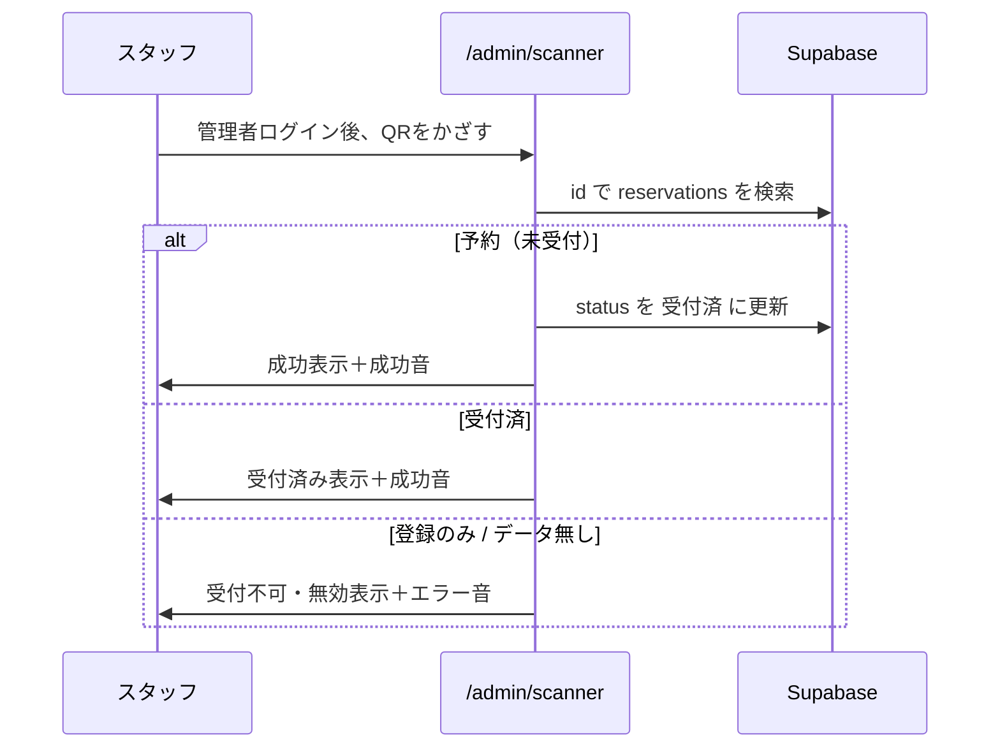

# 設計書

山梨大学生協による **新入生（合格者）向けの来場予約・受付システム**（`line-reserve-app`）の設計書です。
引き継ぎ時に、全体像・データ設計・処理フロー・注意点を把握するための資料です。

---

## 1. システム概要

受験生・新入生は **LINEミニアプリ（LIFF）** から生協の来場イベントに「登録」または「予約」し、当日はスタッフが **QRコード** を読み取って受付します。

- 運営主体：山梨大学生協
- 対象ユーザー：受験生・新入生（LINE）／運営スタッフ（管理画面）
- 目的：合格発表前の見込み把握（登録）と、発表後の来場予約・当日受付の一元管理

---

## 2. 技術構成

| 分類 | 採用技術 |
| --- | --- |
| フレームワーク | Next.js 16（App Router）/ React 19 / TypeScript |
| スタイル | Tailwind CSS v4 |
| バックエンド / DB | Supabase（PostgreSQL＋認証） |
| LINE連携 | LINE LIFF（`@line/liff`） |
| QR読み取り | `@yudiel/react-qr-scanner` |
| QR生成 | `qrcode.react`（クライアント生成） |
| ホスティング | Vercel を想定 |

### アーキテクチャの特徴
- **サーバーサイドのAPI層を持たない**。各画面（クライアントコンポーネント）から Supabase へ直接読み書きする構成。
- そのため、データ保護は **Supabase の RLS（Row Level Security）** に依存する（→ 8章の課題参照）。

---

## 3. 画面構成とルーティング

| パス | 画面 | 利用者 | 認証 |
| --- | --- | --- | --- |
| `/` | 登録/予約フォーム | 受験生（LIFF内） | LINEログイン |
| `/admin` | 管理画面（一覧・枠・受付・班分け） | スタッフ | Supabase Auth |
| `/admin/scanner` | QRコード受付（カメラ） | スタッフ | Supabase Auth |
| `/admin/ticket?id=` | 受付票（QR）表示・印刷 | 受験生／スタッフ | なし |

> ※ 以前あった `/admin/checkin`（受付票URLからの受付）は PR #55 で削除され、受付は `/admin/scanner`（カメラ）に一本化された。

---

## 4. データモデル（Supabase）

### `reservations`（登録・予約データ）
| カラム | 説明 |
| --- | --- |
| `id` | 主キー。受付票QR・URLの識別子にも使う |
| `created_at` | 作成日時 |
| `line_user_id` | LINEのユーザーID（**upsert の競合キー**。1人1レコード） |
| `line_user_name` | LINEの表示名 |
| `last_name` / `first_name` | 氏名 |
| `last_name_kana` / `first_name_kana` | ふりがな（ひらがな） |
| `email` / `phone` | 連絡先 |
| `prefecture` / `city` | 住所 |
| `faculty` / `department` / `admission_type` | 志望（または入学予定）の学部・学科・入試区分 |
| `motivation_level` | 志望度（登録モードのみ） |
| `attendee_count` | 来場予定人数 |
| `slot_id` | 予約枠への参照（登録のみの場合は null） |
| `group_name` | 班（A/B/C班）。班分けで付与 |
| `status` | ステータス（下記参照） |

### `slots`（予約枠）
| カラム | 説明 |
| --- | --- |
| `id` | 主キー |
| `start_time` | 開始日時 |
| `capacity` | 定員 |
| `event_type` | 形式（`対面` / `オンライン`） |

---

## 5. ステータス設計

`reservations.status` は3状態を取り、業務フローと対応する。

| status | 意味 | 主な遷移元 |
| --- | --- | --- |
| `登録` | 合格発表前の事前登録。来場日時は未確定。 | フォーム送信（発表前） |
| `予約` | 発表後、来場日時まで確定。受付票を発行可能。 | フォーム送信（発表後） |
| `受付済` | 当日、QR受付を完了。 | scanner での受付 |

> **重要**：`登録` のみの状態では当日受付はできない（scanner が受付を拒否する）。受付には `予約` への移行が必要。

> **用語の経緯**：以前は `仮登録`（→登録）・`本登録`（→予約）という表記だった。Issue #35 / #36 で現在の表記に統一済み。

---

## 6. 主要な処理フロー

### 6-1. 受験生：登録／予約

### 6-2. スタッフ：当日受付（QR）

---

## 7. 主要な業務ロジック

- **登録／予約モードの自動判定**（`app/page.tsx`）
  - `data/options.ts` の `DETAILED_ANNOUNCEMENT_DATES` から、選択した学部・学科・入試区分に対応する合格発表日を取得。
  - `現在時刻 >= 合格発表日` なら予約モード、未満なら登録モード。
  - 「その他・未定」は全日程の最遅日を採用。マスタ未登録の組み合わせは登録モード扱い。
- **満席判定**（`app/page.tsx`）：枠の予約件数が定員以上なら選択不可。ただし自分が既にその枠を持つ再送信は席を増やさないため免除。
- **1人1レコード**：`line_user_id` を競合キーに upsert するため、同一ユーザーの再送信は上書き更新。
- **班分け**（`app/admin/page.tsx` `handleAssignGroups`）：対象枠の `予約`/`受付済` を学部ごとに集約→学科名順→A/B/C班へ順番に均等割り当て。

---

## 8. 既知の課題・引き継ぎ時の注意点

- **合格発表日マスタにテスト用の日付が混在**（`data/options.ts`）。`//for test` コメントの行（例：工学部・前期を2026年に前倒し）は本番前に正式値へ戻すこと。
- **LIFF ID が `app/page.tsx` に直書き**。別のミニアプリで動かす場合は該当箇所を修正（環境変数化が望ましい）。
- **主体名・イベント名がUIに直書き**（受付票の「山梨大学生協」、LINE通知の「入学準備会」など）。名称変更時は該当箇所を直接修正する必要がある。
- **タブタイトル／メタデータが初期値のまま**（`app/layout.tsx`、Issue #47）。
- **RLSポリシーの確認が未完**（Issue #21）。APIサーバーを持たずクライアントから直接DBアクセスするため、`reservations` / `slots` の RLS 設定がセキュリティの要。
- **status 値を変更した場合、既存データの移行が必要**。文言変更時はDB上の既存行も UPDATE すること。

---

## 9. 環境変数

| 変数名 | 用途 |
| --- | --- |
| `NEXT_PUBLIC_SUPABASE_URL` | Supabase プロジェクトURL |
| `NEXT_PUBLIC_SUPABASE_ANON_KEY` | Supabase 匿名キー |

ローカルは `.env.local`、本番は Vercel のプロジェクト設定に登録する。

---

## 10. 関連ドキュメント

- [ファイル構成.md](./ファイル構成.md) … ディレクトリツリー
- [各ファイルの役割.md](./各ファイルの役割.md) … 各ファイルの責務
- [../README.md](../README.md) … セットアップ手順・機能概要
